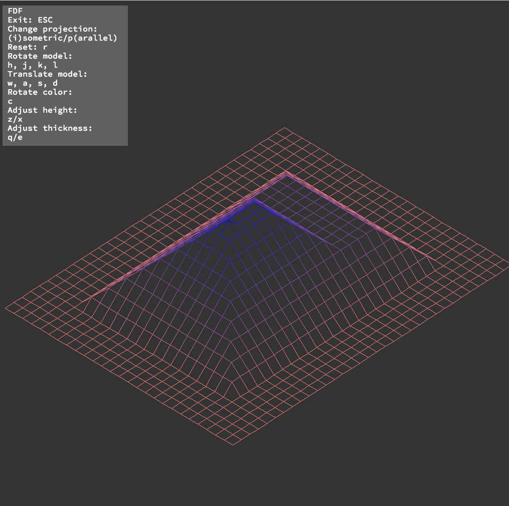

# FDF

The program draws isometric "iron wire" like meshes based of a text representation. See the maps directory for examples. Uses the [MLX42](https://github.com/codam-coding-college/MLX42) graphics library.



## Build

```
git clone git@github.com:Petul/fdf.git

cd fdf

make

# ./fdf maps/<map_of_choice>
# e.g.

./fdf maps/pyramide.fdf
```
## Features
* Line drawing using [Bresenham's Line algorithm](https://en.wikipedia.org/wiki/Bresenham%27s_line_algorithm)
* Isometric and parallel projection
* Rotation of image
* Color interpolation on line
* Scale and line thickness adjustments
* Line-clipping to window edges for improved performance

* Model rotation
    * Use h, j, k and l keys to rotate the model
* Model translation
    * Use w, a, s and d keys to translate the model
* Adjust model height
    * 'z' to decrease height
    * 'x' to increase height
* Adjust line thickness
    * 'e' to increase thickness
    * 'q' to decrese thickness
* Change color
    * Press the 'c' key to rotate through a list of precalculated colorschemes
* Reset model 'r'
* Change projection
    * Isometric projection '1'
    * Parallel projection 'p'
* Exit with ESC

